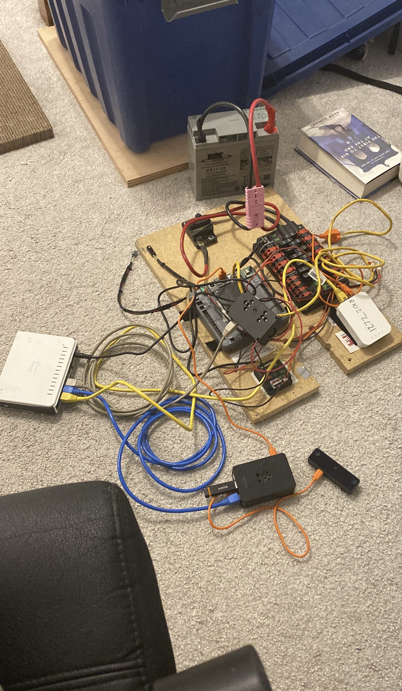
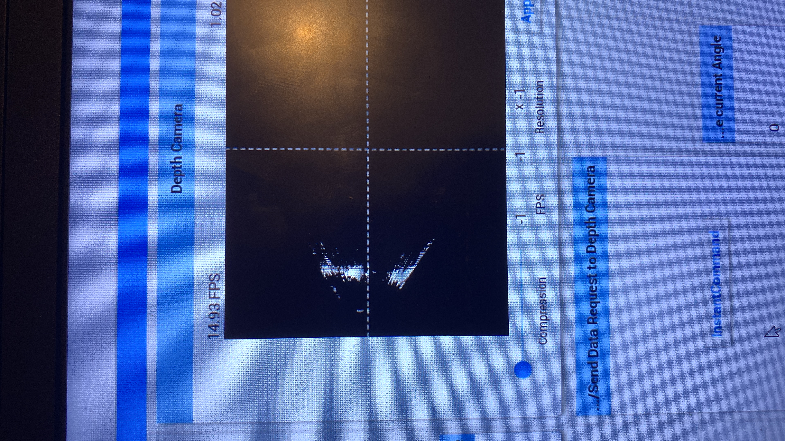

# Depth-assisted Robot Avoidance Tool (DRAT)
The goal of the project is to use the disparity output from a two-camera system (to act like human eyes) to create a birds eye view of what lays ahead of the camera. This output is then added onto a birds eye view of the field to help the robot autonomously move using an odometer and [A*](https://en.wikipedia.org/wiki/A*_search_algorithm), while actively avoiding other robots.

## FRC OAK D LITE Camera 
This project uses a [OAK D-lite camera](https://shop.luxonis.com/products/oak-d-lite-1?variant=42583102456031) with a raspberry pi to create a birds eye view of what is in front of the robot. Note we assume the camera is parallel to the floor!

This project does use the [limelight](https://limelightvision.io/) as well to get the robot position with april tags (make sure the camera is configured at each match/event ... learnt that the hard way)

## Obtaining data for script use

The project uses data found in the current version of pathweaver

Specifically, `wpilib\20XX\tools\PathWeaver.jar\edu\wpi\first\fields` contains the field map and the image config json. Add the JSON to the parameters in the script (it should be later implemented to just import the json)

To generate a binary field map, use [gimp](https://www.gimp.org/) or an image editor and draw  white (blocked) and black (allowed) areas using selection tools (magic wand, etc.).

## Hardware setup

Due to the ethernet port limitations, we used a network bridge to extend the number of ethernet connections we had. We had a Raspberry PI 4, with the OAK D Lite camera connected via usb, the radio connected indirectly via ethernet through the bridge, and a USB from the roborio for power. The limelight was powered the traditional way, and its ethernet was also connected to the bridge. See the (albeit messy) setup to the right.

## Installation and Dependencies
The code was run on a raspberry pi with a USB connection to the depth camera, and an ethernet connection to a network bridge (connected to the roborio).

In general, the script uses
* [Cython](https://cython.org/) to speed up the AStar algorithm
  * `pip install Cython`
  * Make sure AStar.pyx has the contents of AStarPython.py
  * Make sure to compile the code on the raspberry pi
* [DepthAI](https://github.com/luxonis/depthai) to run the OAK D Lite Camera
  * `pip install depthai`
  * See this [link](https://docs.luxonis.com/hardware/platform/deploy/to-rpi/)  for more about installation
* [RobotPy](https://pypi.org/project/robotpy/) to communicate with the FRC robot 
  * `pip install robotpy[cscore]`

On the raspberry pi, if you want to log data onto a seperate USB, [look at this thread](https://forums.raspberrypi.com/viewtopic.php?t=48958).

On the raspberry pi, to run the scripts on boot up, look [here](https://raspberrypi.stackexchange.com/questions/122172/start-python-script-on-startup)

The script was also running on an overclocked raspberry pi. This isn't really needed as performance improved by a couple of fps (10 to 15ish). This comes with the risk of the raspberry pi crashing if it generates too much heat that isn't dissipated. If you know what you are doing then go ahead, otherwise I'd advise against as you can lock yourself out of your raspberry pi/need to over the SD card on a different computer.

Lastly, sure main.py has you're configured parameters. In the future an update should be made to accept command line parameters to move the arguments outside the script!

## Set Up
These files should all be on the raspberry PI.

On the raspberry PI, make sure to run `python AStarSetup.py build_ext --inplace` to generate the AStar.c file with the unix system (this can not be done on the windows computer).

Then ensure that parameters are set in the main.py, and all the hardware is correctly connected. Also ensure that you have set up the script to auto run and to have the usb mounted if you want.

You should be able to then run the main.py script!

## Examples
I did not get any video of this working on the actual robot (oops) but this is what it looked like during development.

[Video of A* creating a path to the center of the field, constantly being updated when the robot changes position](https://drive.google.com/file/d/1MB7YsBj9nMi0uT4ZcynCESx7b2oo5ZZO/view?usp=sharing). It is to be noted that the robot determines its position based off of April tags, which on the actual field are fixed, but are used here to show off different locations.

[Video of the bird eye view map from the depth camera](https://drive.google.com/file/d/1Idkt0do9FYa6cXrbBn98eobt8xs7Gi0T/view?usp=sharing). The left part of the laptop screen shows the bird eye view map, the right side shows the camera's pov, where color indicates how far the object is. This video is before some noise solutions were implemented (guassian blurs, etc.). At the start the lines trace the curving backwall, when pointed towards the hallway, it shows a 

[Video of A* with lattice map visualized](https://drive.google.com/file/d/1wyxvMtRBf1Oo0JQeDbMAcvAinVwXArJJ/view?usp=sharing). Note that visualization slows down A* heavily (especially as this is a colored image running on python not C), but shows how it works. Each point is a pixel "searched." At the end the final path is colored (its very faint on camera, but you can see some pixels with different saturations).

</img>

Image of generate bird eye view camera point towards a wall with a door to the right.

## Current improvements
Currently this project is not being maintained as it was a side project during my senior season (2023-2024), current changes are mainly for readability purposes.